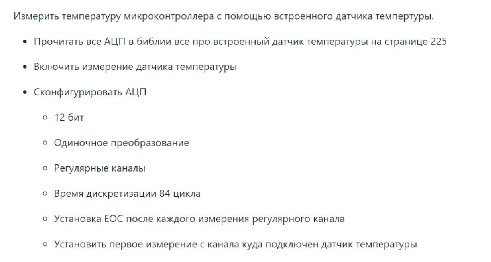
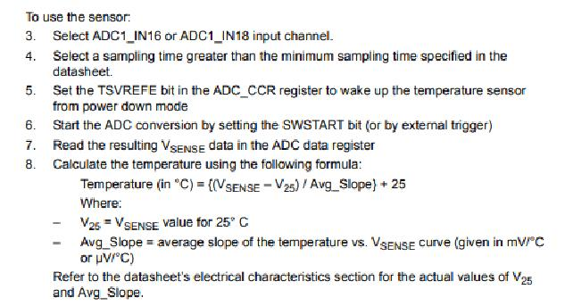
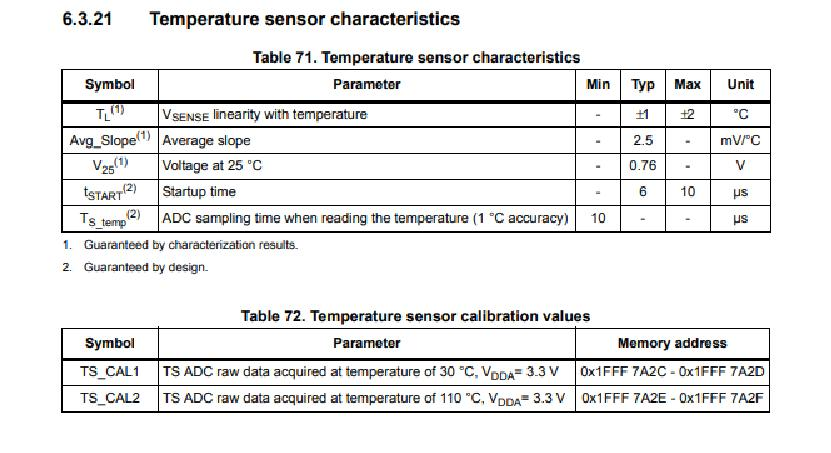
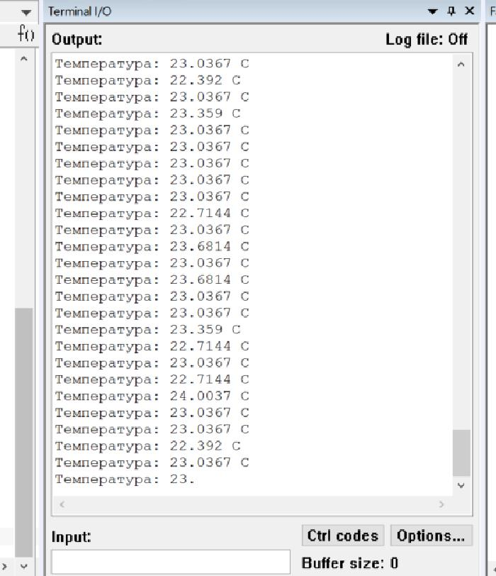

=== _Задание_:

=== _Выполнение задания_:

Для выполнения задания был подключен АЦП по следующим пунктам:

Выбор некоторых параметров исходил из инструкции по подкючению температурного
датчика:

Был подключен 16 канал и 86 циклов.

Для того чтобы температура выводилась верно, необходимо было преобразовать
выходные данные, как это показано в пункте 8. Для этого необходимо воспользоваться
таблицей из даташит.

Также понятно, что показатель Vsense должен быть в вольтах, поэтому значения
на выходе DATA должны быть умножены на коэффициент равный 4096/3.3.

Код программы представлен ниже.

=== _Код программы

----
#include "rccregisters.hpp"
#include "adc1registers.hpp"
#include "gpiocregisters.hpp"
#include "gpioaregisters.hpp"
#include <iostream>
#include <bitset>
#include "nvicregisters.hpp"
#include "adccommonregisters.hpp"

extern "C"
{
  int __low_level_init(void)
  {
    RCC::CR::HSEON::On::Set();
    while(!RCC::CR::HSERDY::Ready::IsSet())
    {
    }

    RCC::CFGR::SW::Hse::Set();
    while(!RCC::CFGR::SWS::Hse::IsSet())
    {
    }
    RCC::CR::HSION::Off::Set();

    RCC::AHB1ENR::GPIOAEN::Enable::Set();

    RCC::APB2ENR::ADC1EN::Enable::Set();

    ADC1::CR1::RES::Bits12::Set();
    ADC1::CR2::CONT::SingleConversion::Set();
    ADC1::CR2::EOCS::SingleConversion::Set();
    ADC1::SQR1::L::Conversions1::Set();
    ADC1::SQR3::SQ1::Channel16::Set();
    ADC1::SMPR2::SMP0::Cycles84::Set();

    ADC_Common::CCR::TSVREFE::Enable::Set();
    ADC1::CR2::ADON::Enable::Set();

    return 1;
  }
}

int main()
{
  for (;;)
  {
    ADC1::CR2::SWSTART::On::Set();
    while(!ADC1::SR::EOC::ConversionComplete::IsSet())
    {
    }
    double Temp = ((ADC1::DR::DATA::Get() *0.000805861 - 0.76) / 0.0025) + 25;
    std::cout << "Температура: " << Temp << " С" << std::endl;
  }
  return 0;
}
----

=== _Результат работы программы

